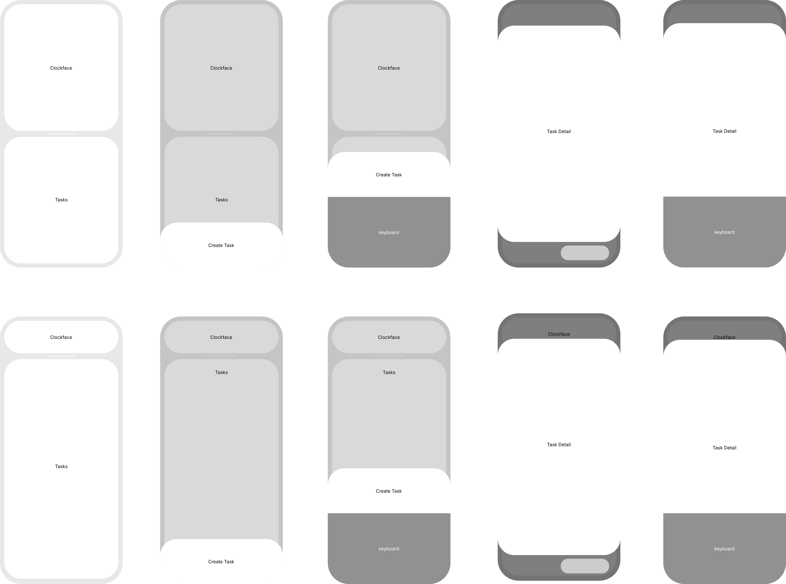

## Question
What is actually drawn in the Penpot file, as opposed to what we intend to build?

## Short answer
-
-
-

## Detail

# Wireframe → Markdown Specification

## Purpose

This document is a geometry-first, text representation of `.pen`. It is intended to let another designer or coding agent reconstruct the wireframe without opening the Penpot file.

The description below preserves the source coordinates, dimensions, colors, corner radii, text labels, and visible state differences. It does **not** invent UI elements that are absent from the `.pen` file. The supplied previous analysis suggests intended interactions such as bottom sheets, swipe actions, and date/time inputs, but those behaviors are documented separately from the actual shapes present in this wireframe. The previous analysis explicitly describes a context-preserving Create Task bottom sheet and gesture-driven actions. [the Google Tasks UX playbook](./google-tasks-ux-playbook.md)

## Global Canvas / Device Geometry

- Every wireframe frame is a **426 × 930 px** frame.
- The frames use rounded outer corners with `cornerRadius=73`.
- The main white content panels generally use a **15 px left/right inset** (`x=15`) and rounded corners.
- Text uses **Inter**, 16 px, normal weight, black unless otherwise specified.
- The wireframe contains a tab-like horizontal structure labeled `Clockface` and `Tasks`.
- A short horizontal white line at `x=160.25`, width `105`, is used as the tab indicator/divider.

## Important Fidelity Rule

The `.pen` source is intentionally sparse. Most visible areas are blank white rectangles. There are no task rows, task titles, checkboxes, date chips, icons, toolbar icons, or detailed form fields encoded in the source. Do not add those elements when reconstructing the wireframe unless a later design artifact explicitly introduces them.

## Frame Inventory

### Frame 1: `gYYIf`

- Canvas position in the Pen document: `x=1180, y=-1106`.
- Frame size: **426 × 930 px**.
- Outer frame corner radius: **73 px**.

1. Rectangle: x=15, y=475.5, width=fill_container(396), height=fill_container(440), cornerRadius=58, fill=#ffffffff.
2. Rectangle: x=15, y=15, width=fill_container(396), height=fill_container(440), cornerRadius=58, fill=#ffffffff.
3. Text: `Tasks` at x=191, y=684; font=Inter, size=16, weight=normal, fill=#000000.
4. Text: `Clockface` at x=174, y=226; font=Inter, size=16, weight=normal, fill=#000000.
5. Path: x=160.25, y=465, width=105, height=0, geometry=`M0 0l39.5 0`, stroke=#ffffffff, strokeWidth=2.
6. Rectangle: x=0, y=0, width=fill_container(426), height=fill_container(930), cornerRadius=73, fill=#00000026.
7. Rectangle: x=0, y=774, width=fill_container(426), height=fill_container(156), cornerRadius=58, fill=#ffffff.
8. Text: `Create Task` at x=167, y=842.5; font=Inter, size=16, weight=normal, fill=#000000.

### Frame 2: `L8zxH`

- Canvas position in the Pen document: `x=1762, y=-1106`.
- Frame size: **426 × 930 px**.
- Outer frame corner radius: **73 px**.

1. Rectangle: x=15, y=475.5, width=fill_container(396), height=fill_container(440), cornerRadius=58, fill=#ffffffff.
2. Rectangle: x=15, y=15, width=fill_container(396), height=fill_container(440), cornerRadius=58, fill=#ffffffff.
3. Text: `Tasks` at x=191, y=684; font=Inter, size=16, weight=normal, fill=#000000.
4. Text: `Clockface` at x=174, y=226; font=Inter, size=16, weight=normal, fill=#000000.
5. Path: x=160.25, y=465, width=105, height=0, geometry=`M0 0l39.5 0`, stroke=#ffffffff, strokeWidth=2.
6. Rectangle: x=0, y=0, width=fill_container(426), height=fill_container(930), cornerRadius=73, fill=#00000026.
7. Rectangle: x=0, y=528.5, width=fill_container(426), height=fill_container(402), cornerRadius=58, fill=#ffffff.
8. Text: `Create Task` at x=167, y=597; font=Inter, size=16, weight=normal, fill=#000000.
9. Rectangle: x=0, y=684.5, width=fill_container(426), height=fill_container(246), fill=#919191ff.
10. Text: `keyboard` at x=177, y=797.5; font=Inter, size=16, weight=normal, fill=#ffffffff.

### Frame 3: `C9Mofg`

- Canvas position in the Pen document: `x=2352, y=-1106`.
- Frame size: **426 × 930 px**.
- Outer frame corner radius: **73 px**.

1. Rectangle: x=15, y=475.5, width=fill_container(396), height=fill_container(440), cornerRadius=58, fill=#ffffffff.
2. Rectangle: x=15, y=15, width=fill_container(396), height=fill_container(440), cornerRadius=58, fill=#ffffffff.
3. Text: `Tasks` at x=191, y=684; font=Inter, size=16, weight=normal, fill=#000000.
4. Text: `Clockface` at x=174, y=226; font=Inter, size=16, weight=normal, fill=#000000.
5. Path: x=160.25, y=465, width=105, height=0, geometry=`M0 0l39.5 0`, stroke=#ffffffff, strokeWidth=2.
6. Rectangle: x=0, y=0, width=fill_container(426), height=fill_container(930), cornerRadius=73, fill=#00000080.
7. Rectangle: x=0, y=89, width=fill_container(426), height=fill_container(752), cornerRadius=58, fill=#ffffff.
8. Text: `Task Detail` at x=171, y=446.5; font=Inter, size=16, weight=normal, fill=#000000.
9. Rectangle: x=219, y=853.5, width=168, height=51, cornerRadius=100, fill=#CCCCCC.

### Frame 4: `o08zlL`

- Canvas position in the Pen document: `x=2927, y=-1106`.
- Frame size: **426 × 930 px**.
- Outer frame corner radius: **73 px**.

1. Rectangle: x=15, y=475.5, width=fill_container(396), height=fill_container(440), cornerRadius=58, fill=#ffffffff.
2. Rectangle: x=15, y=15, width=fill_container(396), height=fill_container(440), cornerRadius=58, fill=#ffffffff.
3. Text: `Tasks` at x=191, y=684; font=Inter, size=16, weight=normal, fill=#000000.
4. Text: `Clockface` at x=174, y=226; font=Inter, size=16, weight=normal, fill=#000000.
5. Path: x=160.25, y=465, width=105, height=0, geometry=`M0 0l39.5 0`, stroke=#ffffffff, strokeWidth=2.
6. Rectangle: x=0, y=-1, width=fill_container(426), height=fill_container(930), cornerRadius=73, fill=#00000080.
7. Rectangle: x=0, y=80.5, width=fill_container(426), height=fill_container(849), cornerRadius=58, fill=#ffffff.
8. Text: `Task Detail` at x=171, y=445.5; font=Inter, size=16, weight=normal, fill=#000000.
9. Rectangle: x=0, y=683.5, width=fill_container(426), height=fill_container(246), fill=#919191ff.
10. Text: `keyboard` at x=177, y=796.5; font=Inter, size=16, weight=normal, fill=#ffffffff.

### Frame 5: `bi8Au`

- Canvas position in the Pen document: `x=624, y=-1106`.
- Frame size: **426 × 930 px**.
- Outer frame corner radius: **73 px**.

1. Rectangle: x=15, y=475.5, width=fill_container(396), height=fill_container(440), cornerRadius=58, fill=#ffffffff.
2. Rectangle: x=15, y=15, width=fill_container(396), height=fill_container(440), cornerRadius=58, fill=#ffffffff.
3. Text: `Tasks` at x=191, y=684; font=Inter, size=16, weight=normal, fill=#000000.
4. Text: `Clockface` at x=174, y=226; font=Inter, size=16, weight=normal, fill=#000000.
5. Path: x=160.25, y=465, width=105, height=0, geometry=`M0 0l39.5 0`, stroke=#ffffffff, strokeWidth=2.

### Frame 6: `Q1W8PG`

- Canvas position in the Pen document: `x=624, y=-6`.
- Frame size: **426 × 930 px**.
- Outer frame corner radius: **73 px**.

1. Rectangle: x=15, y=148.5, width=fill_container(396), height=fill_container(763), cornerRadius=58, fill=#ffffffff.
2. Rectangle: x=15, y=15, width=fill_container(396), height=fill_container(113), cornerRadius=58, fill=#ffffffff.
3. Text: `Tasks` at x=191, y=511; font=Inter, size=16, weight=normal, fill=#000000.
4. Text: `Clockface` at x=174, y=62; font=Inter, size=16, weight=normal, fill=#000000.
5. Path: x=160.25, y=138, width=105, height=0, geometry=`M0 0l39.5 0`, stroke=#ffffffff, strokeWidth=2.

### Frame 7: `IJexV`

- Canvas position in the Pen document: `x=1180, y=-6`.
- Frame size: **426 × 930 px**.
- Outer frame corner radius: **73 px**.

1. Rectangle: x=15, y=148.5, width=fill_container(396), height=fill_container(763), cornerRadius=58, fill=#ffffffff.
2. Rectangle: x=15, y=15, width=fill_container(396), height=fill_container(113), cornerRadius=58, fill=#ffffffff.
3. Text: `Tasks` at x=191, y=184; font=Inter, size=16, weight=normal, fill=#000000.
4. Text: `Clockface` at x=174, y=62; font=Inter, size=16, weight=normal, fill=#000000.
5. Path: x=160.25, y=138, width=105, height=0, geometry=`M0 0l39.5 0`, stroke=#ffffffff, strokeWidth=2.
6. Rectangle: x=0, y=-0.5, width=fill_container(426), height=fill_container(930), cornerRadius=73, fill=#00000026.
7. Rectangle: x=0, y=773.5, width=fill_container(426), height=fill_container(402), cornerRadius=58, fill=#ffffff.
8. Text: `Create Task` at x=167, y=842; font=Inter, size=16, weight=normal, fill=#000000.

### Frame 8: `QRCOO`

- Canvas position in the Pen document: `x=1762, y=-6`.
- Frame size: **426 × 930 px**.
- Outer frame corner radius: **73 px**.

1. Rectangle: x=15, y=148.5, width=fill_container(396), height=fill_container(763), cornerRadius=58, fill=#ffffffff.
2. Rectangle: x=15, y=15, width=fill_container(396), height=fill_container(113), cornerRadius=58, fill=#ffffffff.
3. Text: `Tasks` at x=191, y=184; font=Inter, size=16, weight=normal, fill=#000000.
4. Text: `Clockface` at x=174, y=62; font=Inter, size=16, weight=normal, fill=#000000.
5. Path: x=160.25, y=138, width=105, height=0, geometry=`M0 0l39.5 0`, stroke=#ffffffff, strokeWidth=2.
6. Rectangle: x=0, y=-0.5, width=fill_container(426), height=fill_container(930), cornerRadius=73, fill=#00000026.
7. Rectangle: x=0, y=528, width=fill_container(426), height=fill_container(402), cornerRadius=58, fill=#ffffff.
8. Text: `Create Task` at x=167, y=596.5; font=Inter, size=16, weight=normal, fill=#000000.
9. Rectangle: x=0, y=684, width=fill_container(426), height=fill_container(246), fill=#919191ff.
10. Text: `keyboard` at x=177, y=797; font=Inter, size=16, weight=normal, fill=#ffffffff.

### Frame 9: `n5qiww`

- Canvas position in the Pen document: `x=2927, y=-6`.
- Frame size: **426 × 930 px**.
- Outer frame corner radius: **73 px**.

1. Rectangle: x=15, y=148.5, width=fill_container(396), height=fill_container(763), cornerRadius=58, fill=#ffffffff.
2. Rectangle: x=15, y=15, width=fill_container(396), height=fill_container(113), cornerRadius=58, fill=#ffffffff.
3. Text: `Tasks` at x=191, y=184; font=Inter, size=16, weight=normal, fill=#000000.
4. Text: `Clockface` at x=174, y=62; font=Inter, size=16, weight=normal, fill=#000000.
5. Path: x=160.25, y=138, width=105, height=0, geometry=`M0 0l39.5 0`, stroke=#ffffffff, strokeWidth=2.
6. Rectangle: x=0, y=-0.5, width=fill_container(426), height=fill_container(930), cornerRadius=73, fill=#00000080.
7. Rectangle: x=0, y=81, width=fill_container(426), height=fill_container(849), cornerRadius=58, fill=#ffffff.
8. Text: `Task Detail` at x=171, y=446; font=Inter, size=16, weight=normal, fill=#000000.
9. Rectangle: x=0, y=684, width=fill_container(426), height=fill_container(246), fill=#919191ff.
10. Text: `keyboard` at x=177, y=797; font=Inter, size=16, weight=normal, fill=#ffffffff.

### Frame 10: `sv0X3`

- Canvas position in the Pen document: `x=2352, y=-17`.
- Frame size: **426 × 930 px**.
- Outer frame corner radius: **73 px**.

1. Rectangle: x=15, y=148.5, width=fill_container(396), height=fill_container(763), cornerRadius=58, fill=#ffffffff.
2. Rectangle: x=15, y=15, width=fill_container(396), height=fill_container(113), cornerRadius=58, fill=#ffffffff.
3. Text: `Tasks` at x=191, y=184; font=Inter, size=16, weight=normal, fill=#000000.
4. Text: `Clockface` at x=174, y=62; font=Inter, size=16, weight=normal, fill=#000000.
5. Path: x=160.25, y=138, width=105, height=0, geometry=`M0 0l39.5 0`, stroke=#ffffffff, strokeWidth=2.
6. Rectangle: x=0, y=-0.5, width=fill_container(426), height=fill_container(930), cornerRadius=73, fill=#00000080.
7. Rectangle: x=0, y=88.5, width=fill_container(426), height=fill_container(752), cornerRadius=58, fill=#ffffff.
8. Text: `Task Detail` at x=171, y=446; font=Inter, size=16, weight=normal, fill=#000000.
9. Rectangle: x=219, y=853, width=168, height=51, cornerRadius=100, fill=#CCCCCC.

## State Interpretation

### Primary screen / no overlay

Frames 5 and 6 in the source (`Q1W8PG` and `IJexV`) share the same base structure:

- Upper white rounded panel: `x=15, y=15, width=396, height=113`, `cornerRadius=58`.
- Lower/main white rounded panel: `x=15, y=148.5, width=396, height=763`, `cornerRadius=58`.
- `Clockface` is positioned near the top at `x=174, y=62`.
- `Tasks` is positioned in the main panel at `x=191, y=184` in Frame 6 and `y=511` in Frame 5.
- The white horizontal path sits at `x=160.25, y=138`, width `105`, stroke `#ffffff`, width `2`.

The source does not encode additional content inside the main panel.

### Create Task sheet, keyboard hidden

Frame 6 (`IJexV`) is the base screen with a dimmed overlay and a bottom sheet:

- Full-frame translucent overlay: `x=0, y=-0.5, width=426, height=930`, fill `#00000026`, corner radius `73`.
- Bottom sheet: `x=0, y=773.5, width=426, height=402`, fill `#ffffff`, corner radius `58`.
- `Create Task`: x=`167`, y=`842`.
- The sheet extends beyond the 930 px frame height, so only its upper portion is visible within the frame.

### Create Task sheet, keyboard visible

Frame 7 (`QRCOO`) moves the Create Task sheet upward and adds a keyboard placeholder:

- Full-frame translucent overlay: `#00000026`.
- Create Task sheet: `x=0, y=528, width=426, height=402`, fill `#ffffff`, corner radius `58`.
- `Create Task`: x=`167`, y=`596.5`.
- Keyboard placeholder: `x=0, y=684, width=426, height=246`, fill `#919191`.
- `keyboard`: white text at x=`177`, y=`797`.

The source therefore visually represents the sheet rising when the keyboard is present.

### Task Detail sheet, keyboard hidden

Frame 10 (`sv0X3`) shows a task-detail overlay without the keyboard:

- Full-frame dim overlay: `#00000080`.
- Task Detail sheet: `x=0, y=88.5, width=426, height=752`, fill `#ffffff`, corner radius `58`.
- `Task Detail`: x=`171`, y=`446`.
- Bottom-right control placeholder: `x=219, y=853, width=168, height=51`, fill `#CCCCCC`, `cornerRadius=100`.

Frame 3 (`C9Mofg`) is an earlier/alternate version of this state:

- Overlay: `#00000080`.
- Detail sheet begins at `y=89`, width `426`, height `752`.
- `Task Detail` remains centered around the vertical middle.
- The same rounded gray control placeholder appears at `x=219, y=853`, width `168`, height `51`.

### Task Detail sheet, keyboard visible

Frame 9 (`n5qiww`) shows the detail sheet with keyboard:

- Full-frame dim overlay: `#00000080`.
- Detail sheet: `x=0, y=81, width=426, height=849`, fill `#ffffff`, corner radius `58`.
- `Task Detail`: x=`171`, y=`446`.
- Keyboard placeholder: `x=0, y=684, width=426, height=246`, fill `#919191`.
- `keyboard`: white text at x=`177`, y=`797`.

Frame 4 (`o08zlL`) is a closely related earlier variant with the detail sheet starting at `y=80.5`.

## Alternate / Exploratory Row

Frames 1–5 in the source file (Pen document row around `y=-1106`) appear to be earlier or exploratory compositions of the same interaction states. They should be preserved as references rather than silently discarded because they show the progression of the layout.

### Exploratory base structure

Frame 5 (`bi8Au`) contains:
- Two separate white rounded rectangles, each `396 px` wide with a `15 px` side inset.
- Upper rectangle: `x=15, y=15`, height `440`, `cornerRadius=58`.
- Lower rectangle: `x=15, y=475.5`, height `440`, `cornerRadius=58`.
- `Clockface` at x=`174`, y=`226`.
- `Tasks` at x=`191`, y=`684`.

This differs materially from the later base layout, which uses one 113 px top panel and one 763 px main panel.

### Exploratory Create Task states

Frame 1 (`gYYIf`) uses the exploratory two-panel base with:
- overlay `#00000026` over the full frame.
- bottom sheet `x=0, y=774, width=426, height=156`, white, `cornerRadius=58`.
- `Create Task` at x=`167`, y=`842.5`.

Frame 2 (`L8zxH`) uses:
- overlay `#00000026`.
- Create Task sheet `x=0, y=528.5, width=426, height=402`, white, `cornerRadius=58`.
- keyboard placeholder `x=0, y=684.5, width=426, height=246`, fill `#919191`.
- `keyboard` at x=`177`, y=`797.5`, white.

### Exploratory Task Detail states

Frame 3 (`C9Mofg`) contains:
- overlay `#00000080`.
- detail sheet `x=0, y=89, width=426, height=752`, white, `cornerRadius=58`.
- `Task Detail` at x=`171`, y=`446.5`.
- rounded gray control placeholder `x=219, y=853.5, width=168, height=51`, `cornerRadius=100`.

Frame 4 (`o08zlL`) contains:
- overlay `#00000080`.
- detail sheet `x=0, y=80.5, width=426, height=849`, white, `cornerRadius=58`.
- `Task Detail` at x=`171`, y=`445.5`.
- keyboard placeholder `x=0, y=683.5, width=426, height=246`, fill `#919191`.
- `keyboard` at x=`177`, y=`796.5`, white.

## Interaction Notes from the Previous Analysis

The previous analysis describes the intended UX direction as an offline-first task module with:

- context-preserving Create Task bottom sheets;
- keyboard focus when the sheet opens;
- swipe-right completion and swipe-left deletion;
- icon-driven actions for dates, subtasks, and lists;
- native/native-feeling date and time pickers.

Those are **interaction intentions**, not elements explicitly drawn in the current `.pen` file. The source analysis also identifies an offline architecture and a Task model, but those implementation details are intentionally not mixed into the visual reconstruction.[the Google Tasks UX playbook](./google-tasks-ux-playbook.md)

## Reconstruction Checklist

A faithful implementation should reproduce, at minimum:

1. A 426 × 930 mobile frame with 73 px outer rounding.
2. A two-level base layout with a 15 px horizontal inset.
3. `Clockface` in the upper area and `Tasks` in the main area.
4. The 105 px white horizontal indicator at y=`138` in the refined layout.
5. A dim overlay for modal states, using `#00000026` for Create Task and `#00000080` for Task Detail.
6. A white rounded bottom/detail sheet whose vertical position changes when the keyboard is visible.
7. A gray keyboard placeholder occupying the lower 246 px of the frame when active.
8. The exact placeholder labels and coordinates listed above.
9. No invented task rows or extra controls that are absent from the source wireframe.

## What would change my mind
A newer `.pen` export. This note is a snapshot of one file on one day — if the
Penpot file moves on, archive this and write a new one.

## Open questions
- Does the `Clockface` / `Tasks` split survive contact with a real user, or is it
  two apps stapled together?

---
Part of [Routine App](../README.md)
