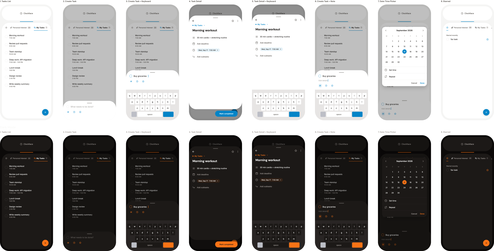

## Question
What does the new hi-fi export actually show, and where does it diverge from
the intent behind [the wireframe](./wireframe-geometry-spec.md) and
[the Google Tasks playbook](./google-tasks-ux-playbook.md)?

## Short answer
- It is the reconstruction the wireframe spec pointed at: 8 screens, light and
  dark, with real task rows, icons, and a working Create/Detail/Date-picker
  flow — the "no invented elements" caveat no longer applies to this note.
- The layout and iconography are a near-literal Google Tasks clone (bottom
  sheet compose, list/clock/star icon row, pill "Mark completed" button,
  month-grid date picker). That may be the right move for a personal tool, but
  it is worth naming out loud rather than drifting into by accident. See
  [decision 0004](../decisions/0004-clone-google-tasks-interactions.md).

## Detail

### What's on screen

`santian-hifi-export.html` renders 8 screens twice — once light, once dark:

1. **Tasks List** — tab row `Personal Interest (20)` / `My Tasks (1)`, active
   tab underlined; 7 task rows with title + time (`Morning workout 7:00 AM` …
   `Write weekly summary 4:00 PM`); FAB in the corner.
2. **Create Task** — same list, plus a compose row (`What needs to be done?`)
   and an icon row (list / clock / star) pinned under it.
3. **Create Task + Keyboard** — the compose row mid-type (`Buy groceries`)
   with the keyboard docked.
4. **Task Detail** — breadcrumb (`My Tasks ⌄`), star, kebab menu, title,
   description, an `Add deadline` row that becomes a removable date chip
   (`Wed, Sep 17 · 7:00 AM ×`), `Add subtasks`, and a `Mark completed` pill.
5. **Task Detail + Keyboard** — same sheet with `Add details` focused and the
   keyboard docked.
6. **Create Task + Note** — the list view with the compose row expanded
   in-place (`Buy groceries` / `Add details` / icon row), rather than in a
   separate sheet.
7. **Date Time Picker** — a month grid (`September 2026`), the selected day
   circled, then `Set time` / `Repeat` rows and `Cancel` / `Done`.
8. **Starred** — same shell, `Starred recently` section, one row (`fav
   task`).

This directly answers the fidelity gap the wireframe spec called out: that
file was deliberately blank ("no task rows, checkboxes, date chips, icons...
do not add those elements... unless a later design artifact explicitly
introduces them"). This is that later artifact. The wireframe spec's
reconstruction checklist can be considered satisfied, not just intended.

### It reads as a Google Tasks skin, not an original

Every interaction pattern here — the bottom-sheet compose, the icon row for
date/subtask/star, the swipe-implying row layout, the pill-shaped complete
button, the calendar picker — matches
[the Google Tasks playbook](./google-tasks-ux-playbook.md) closely enough
that a screenshot side-by-side would need labels to tell them apart. Given
[decision 0003](../decisions/0003-personal-tool-not-a-product.md) (personal
tool, not a product), that's plausibly fine — no need to invent interaction
patterns nobody asked for. But it's a choice, not a default, and it hasn't
been written down anywhere as one. Worth a one-line decision: "we are
deliberately cloning Google Tasks' interaction model and only changing visual
skin," so nobody later treats the resemblance as accidental scope creep.

### Everything else looks internally consistent

Corner radii, spacing, and the two-panel Clockface/Tasks shell from the
wireframe carry through cleanly. Typography (`DM Sans`) is used everywhere it
should be. The Create Task and Task Detail sheets share the same icon
language, which is good — a user only has to learn it once.

## Open questions
- Now answered by [decision 0004](../decisions/0004-clone-google-tasks-interactions.md):
  the Google Tasks resemblance is deliberate, not accidental drift.

---
Part of [Santian](../README.md)
