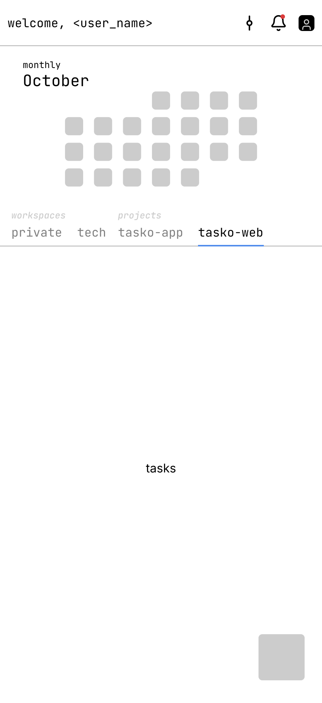

## Question
What does the owner's home screen wireframe show, and what does each part
mean? It was confirmed in chat on 2026-10-06.

## Short answer
- From top to bottom: a header (greeting, an unknown icon, a bell with an
  unread dot, an avatar), then a **monthly calendar**, then a **tab bar** in
  two groups (*workspaces*, *projects*), then the task list and a FAB.
- The tabs are `private` (the user's personal tasks), each division the
  user belongs to, then each project they belong to. Every task appears in
  exactly one tab ([0002](../decisions/0002-tabs-are-workspaces-then-projects.md)).
- The calendar shows how many open tasks are due on each day of the month,
  for the active tab. Tapping a day filters the list to that day
  ([0003](../decisions/0003-calendar-is-a-due-date-heatmap-that-filters.md)).

## Detail

Low-fidelity: grey boxes, a monospace placeholder font, `<user_name>`.
Read it for structure, not for pixels.

| Part | What is drawn | Meaning |
|---|---|---|
| Header | "welcome, &lt;user_name&gt;", a vertical slider-like icon, 🔔 with a red dot, a square avatar | The bell maps to the `notifications` table, and the dot to unread rows (`read_at` is null). The avatar is `users.avatar`. **The slider icon is unexplained.** |
| Calendar | the label "monthly" above "October" in large type, then 7 columns of rounded grey cells, Monday first | October 2026 starts on a Thursday, and the first cell sits in column 4, so the grid is real. Only 23 cells are drawn, which looks like an unfinished wireframe. "monthly" suggests the period can change. |
| Tab bar | small italic group labels *workspaces* (`private`, `tech`) and *projects* (`tasko-app`, `tasko-web`). The active tab has dark text and a blue underline | `private` = `personal_tasks`. `tech` = a `divisions` row. Projects = `projects` the user is a member of. |
| Task list | the placeholder "tasks" | Not designed yet. Santian's [row](../../santian/hipster/task-row-as-built.md) is the starting point, see [the screens note](./santian-screens-in-a-team-app.md). |
| FAB | a grey square in the bottom right | Create a task in the active tab. |

### Kept from Santian
- A tab bar that scrolls sideways, with one underline on the active tab.
  Swiping between tabs is not shown, but nothing rules it out.
- A FAB for creating tasks.

### Different from Santian
- **No Star tab**, and no `+` tab for adding Lists.
- Tabs come in **two labelled groups**.
- The calendar and header sit above the tabs, so the task list gets less
  height than Santian's full-height card.
- There is no "Tasks" card title. The greeting takes its place.

## What would change my mind
- A user with many projects finds the tab bar too long to swipe through.
  The group labels would then also need to scroll or stay pinned.

## Open questions
- What is the slider icon next to the bell? A filter, settings, or a
  timeline?
- What else does "monthly" switch to? Weekly?
- Does a group label stay pinned while its tabs scroll out of view?
- Is the Star gone completely, or only the tab?

---
Part of [Tasko](../README.md)
